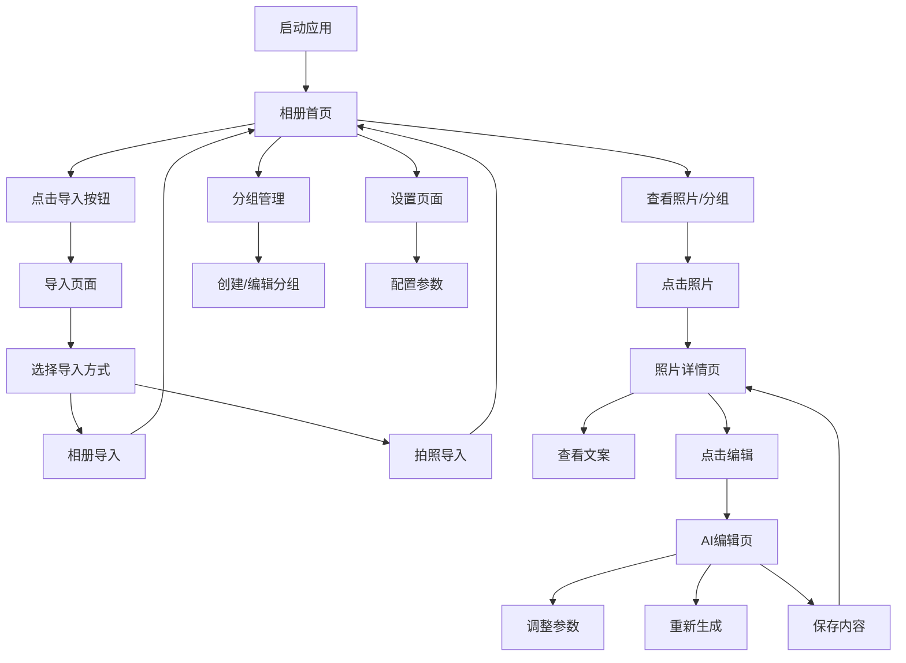

# 📱 PhotoInsight 项目代码结构文档

## 🏗️ **项目架构概览**

PhotoInsight 是一个基于 **Expo + React Native** 的照片管理和AI文案生成应用，采用 **文件路由** 架构，为用户提供智能化的照片管理和文案生成服务。

### 📦 **技术栈**
- **框架**: Expo SDK 53 + React Native 0.79
- **路由**: Expo Router (文件路由)
- **UI组件**: React Native Elements + 自定义组件
- **动画**: React Native Reanimated
- **图标**: Expo Vector Icons (FontAwesome)
- **状态管理**: React Hooks (useState, useEffect)
- **类型检查**: TypeScript
- **权限管理**: Expo Camera, Expo Image Picker
- **存储**: AsyncStorage

## 📁 **项目结构分析**

### 1. **根目录结构**
```
photoInsight/
├── app/                    # Expo Router 路由文件
│   ├── _layout.tsx         # 根布局配置
│   ├── (tabs)/             # 底部标签导航
│   │   ├── _layout.tsx     # 标签页布局
│   │   ├── index.tsx       # 重定向页面
│   │   ├── p-album_home.tsx # 相册首页
│   │   ├── p-group_manage.tsx # 分组管理
│   │   └── p-settings.tsx  # 设置页面
│   ├── p-photo_detail.tsx  # 照片详情页
│   ├── p-ai_edit.tsx       # AI文案编辑页
│   └── p-import.tsx        # 照片导入页
├── screens/                # 主要页面组件
│   ├── p-album_home/       # 相册首页模块
│   ├── p-photo_detail/     # 照片详情模块
│   ├── p-ai_edit/          # AI编辑模块
│   ├── p-import/           # 导入模块
│   ├── p-group_manage/     # 分组管理模块
│   └── p-settings/         # 设置模块
├── assets/                 # 静态资源
│   ├── fonts/              # 字体文件
│   └── images/             # 图片资源
├── package.json           # 项目配置
├── tsconfig.json          # TypeScript配置
└── README.md              # 项目说明
```

### 2. **页面组件结构** (`screens/` 目录)

每个页面都采用模块化设计：
```
screens/p-[page_name]/
├── index.tsx              # 主页面组件
├── styles.ts              # 样式文件
├── types.ts               # 类型定义 (可选)
└── components/            # 子组件
    ├── ComponentName/
    │   ├── index.tsx      # 组件实现
    │   └── styles.ts      # 组件样式
```

## 🎯 **核心功能模块**

### 1. **相册首页** (`p-album_home`)
**功能**: 照片网格展示、分组切换、浮动操作按钮

**主要组件**:
- `PhotoGrid`: 照片网格布局 (3列布局)
- `PhotoItem`: 单个照片项 (支持多选模式)
- `GroupsList`: 分组列表展示
- `Header`: 页面头部 (标题、搜索、设置)
- `ViewTabs`: 视图切换标签 (照片/分组)
- `FloatingActionButton`: 浮动导入按钮
- `Watermark`: 水印组件

**核心特性**:
- 支持照片多选模式
- 长按进入多选状态
- 分组和照片视图切换
- 响应式网格布局

### 2. **照片详情页** (`p-photo_detail`)
**功能**: 照片展示、文案内容、操作按钮

**主要组件**:
- `ContentSection`: 文案内容区域 (灵感句、宣传段、标签、诗歌)
- `TagItem`: 标签项展示
- `ActionButton`: 操作按钮 (重新生成、复制、编辑、删除)
- `Toast`: 提示消息

**核心特性**:
- 支持左右滑动切换照片
- 文案内容分类展示
- 点赞/踩功能
- 一键复制文案
- 重新生成AI文案

### 3. **AI文案编辑页** (`p-ai_edit`)
**功能**: AI文案生成、参数调整、内容编辑

**主要组件**:
- `ParameterSection`: 参数设置区域
- `CopyOptionsModal`: 复制选项弹窗
- `SelectOption`: 选择选项组件
- `ToastMessage`: 提示消息

**核心特性**:
- 多种文案类型生成
- 参数实时调整
- 字数统计
- 多平台适配 (微信、小红书等)
- 语言风格选择

### 4. **照片导入页** (`p-import`)
**功能**: 从相册导入、拍照导入

**主要组件**:
- `ImportOption`: 导入选项卡片

**核心特性**:
- 相册权限管理
- 相机权限管理
- 多选照片导入
- 拍照即时导入

### 5. **分组管理页** (`p-group_manage`)
**功能**: 创建/编辑/删除分组、AI自动分组

**主要组件**:
- `GroupItem`: 分组项展示
- `Toast`: 提示消息

**核心特性**:
- 手动分组管理
- AI智能分组
- 分组封面设置
- 分组重命名/删除

### 6. **设置页面** (`p-settings`)
**功能**: 应用设置、默认参数配置

**主要组件**:
- `SettingItem`: 设置项组件

**核心特性**:
- 默认文案设置
- 通知开关
- 语言风格配置
- 社交媒体平台设置

## 🔧 **关键特性**

### 1. **导航系统**
- 使用 Expo Router 实现文件路由
- 支持标签导航和堆栈导航
- 手势导航支持
- 页面间参数传递

### 2. **UI/UX 设计**
- 深色主题设计
- 现代化UI组件
- 流畅的动画效果 (Reanimated)
- 响应式布局
- 毛玻璃效果 (expo-blur)

### 3. **数据管理**
- 使用 React Hooks 进行状态管理
- 模拟数据存储 (可扩展为真实API)
- 本地存储支持 (AsyncStorage)
- 类型安全的数据结构

### 4. **权限管理**
- 相机权限 (expo-camera)
- 相册权限 (expo-image-picker)
- 权限请求和错误处理
- 用户友好的权限提示

### 5. **性能优化**
- 图片懒加载
- 组件按需渲染
- 动画性能优化
- 内存管理

## 📱 **应用流程**



## 🎨 **设计模式**

### 1. **组件化设计**
- 每个功能模块独立封装
- 组件职责单一
- 高复用性
- 易于测试和维护

### 2. **类型安全**
- 使用 TypeScript 确保类型安全
- 接口定义清晰
- 编译时错误检查

### 3. **样式分离**
- 样式文件独立管理
- 主题化设计
- 响应式样式

### 4. **模块化路由**
- 基于文件的路由系统
- 路由配置集中管理
- 动态路由支持

## 🚀 **开发指南**

### 环境要求
- Node.js 18+
- Expo CLI
- iOS Simulator / Android Emulator

### 安装和运行
```bash
# 安装依赖
npm install

# 启动开发服务器
npx expo start

# 运行在iOS模拟器
npx expo start --ios

# 运行在Android模拟器
npx expo start --android
```

### 项目结构扩展建议
1. **状态管理**: 可考虑引入 Redux Toolkit 或 Zustand
2. **API集成**: 添加真实的后端API调用
3. **数据持久化**: 集成 SQLite 或 Realm
4. **推送通知**: 集成 Expo Notifications
5. **分析工具**: 添加用户行为分析

## 📝 **代码规范**

- 使用 TypeScript 进行类型检查
- 遵循 React Native 最佳实践
- 组件命名采用 PascalCase
- 文件命名采用 kebab-case
- 样式使用 StyleSheet API

---

*本文档详细描述了 PhotoInsight 项目的代码结构和架构设计，为开发团队提供清晰的项目概览和开发指导。* 